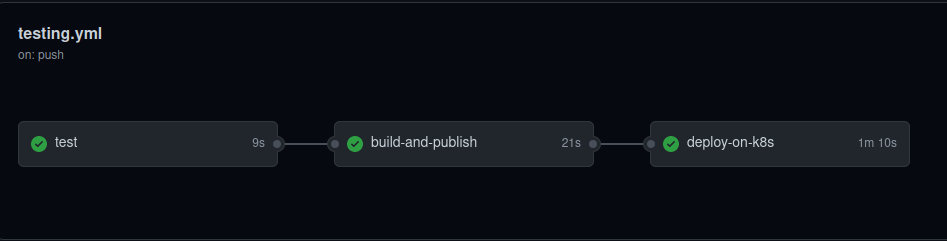

# Documentacion

## Informacion importante

### Servicios utilizaos
- Google Api Gateway
- Google Kubernetes Engine
- Google Credentials
- Github
- Github Actions para CI/CD
- Docker Hub para publicar las imagenes

### Pipelines en Github



### Pasos para probar
1. Tener cuenta en github
2. Tener cuenta en Docker hub
3. Tener cuenta en Google Cloud


* Crear el cluster en kubernetes
```bash
make create-k8s-cluster
```

* Setear gcloud con el cluster creado anteriormente
  
```bash
gcloud container clusters get-credentials [NOMBRE_DEL_CLUSTER_CREADO] --region=[REGION_DEL_CLUSTER]
```

* Crear deployments

```bash
make create-deployments
```

* Crear Api Gateway
```bash
make create-api-gateway
```
